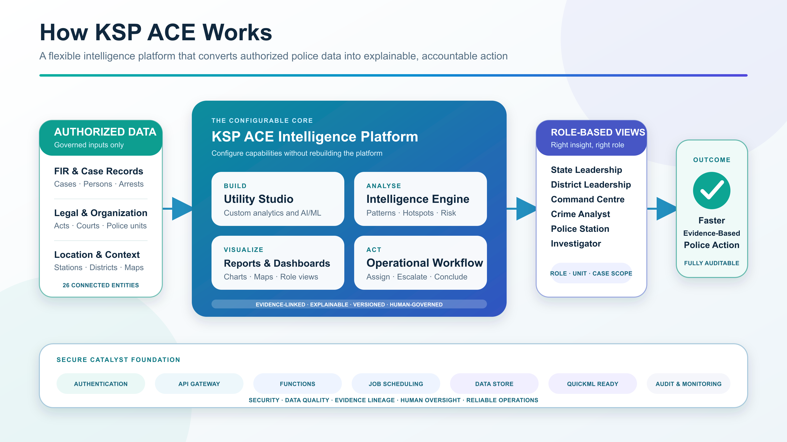

<p align="center">
  
</p>

<h1 align="center">KSP ACE Intelligence Platform</h1>

<p align="center">
  <strong>A mission-adaptive analytics and visualization platform for explainable, role-aware and accountable policing.</strong>
</p>

<p align="center">
  Most dashboards answer only predefined questions. KSP ACE lets authorized police teams configure the next one.
</p>

<p align="center">
  <a href="https://ace.onslate.in"></a>
  <a href="Architecture.md"></a>
  <a href="PRD.md"></a>
</p>

<p align="center">
  
  
  
  
</p>

> [!IMPORTANT]
> The live link is a functional Catalyst **Development** deployment using deterministic synthetic data. This repository is not certified for operational police use and contains no real KSP records.

## Why KSP ACE

KSP ACE is not a fixed dashboard or a collection of hard-coded charts. It combines a **configurable analytics utility layer** with a **composable visualization studio**, allowing authorized teams to create mission-specific analytics, reports, maps and dashboards without rebuilding the platform.

```text
Authorized police data
        → governed analytical utilities
        → explainable findings and visualizations
        → role-specific workspaces
        → human review and accountable action
```

### What makes it different

| Conventional dashboard | KSP ACE platform |
|---|---|
| Answers predefined questions | Supports new questions through configurable utilities |
| Ships fixed reports | Builds and combines reports, maps and dashboards |
| Gives every user a similar view | Adapts intelligence to role, unit and case scope |
| Shows a score or alert | Preserves method, evidence, quality and limitations |
| Ends at visualization | Continues through assignment, escalation and outcome |
| Requires redevelopment for new use cases | Extends through governed custom analytics and AI/ML utilities |

## Platform Capabilities

| Capability | What the prototype demonstrates |
|---|---|
| **Intelligence Utility Studio** | Reusable utilities across patterns, spatial intelligence, trends, anomalies and risk prioritization |
| **Explainable Analytics Engine** | Hotspots, temporal anomalies, repeat identity, networks, area risk and cross-district Pattern Fusion |
| **Governed Report Builder** | Tables, bars, lines, pies, funnels, risk views and map-based reports over authorized semantic sources |
| **Composable Dashboard Studio** | Add, remove, resize, arrange, share and assign role-default intelligence views |
| **Geospatial Intelligence** | Hotspots, clusters, risk layers, visible-feature tables and evidence drill-down |
| **Relationship Intelligence** | Evidence-labelled links across cases, persons, co-accused, locations, legal events and timelines |
| **Alert-to-Outcome Workflow** | Acknowledge, assign, note, escalate, conclude and record operational outcomes |
| **Governed Operations** | Versioned intelligence runs, optimistic concurrency, safe retries and traceable audit events |

## One Platform, Multiple Policing Perspectives

| Persona | Default intelligence experience |
|---|---|
| **State Police Leadership** | Statewide trends, cross-boundary patterns and monitored outcomes |
| **District / Regional Leadership** | Station context, attention queues, assignments and escalation |
| **Command Centre** | Aggregate, read-only operational overview for coordination |
| **Crime Analyst** | Synchronized maps, timelines, networks, evidence and structured conclusions |
| **Station Operations** | Local signals, pending actions and station-level intelligence |
| **Investigator** | Assigned alerts, evidence verification and scoped case relationships |
| **Administrator / Auditor** | Platform health, governed configuration and append-only traceability |

## Architecture at a Glance

<p align="center">
  
</p>

The platform keeps five responsibilities separate: governed ingestion, analytical execution, evidence persistence, role-scoped delivery and human workflow. A user-interface card never invents intelligence; it renders a persisted result produced from an accepted batch.

For the complete technical design, see [Architecture.md](Architecture.md).

## Prototype Performance

The scale benchmark exercises deterministic feature records locally and does not load 50,000 FIRs into Catalyst Development.

| Benchmark | Observed result |
|---|---:|
| Deterministic feature scale | **50,000** |
| Theoretical feature pairs | **1,249,975,000** |
| Pattern Fusion candidates | **669,412** |
| Candidate reduction | **99.9464%** |
| Local elapsed time | **10.60 seconds** |
| Approximate Node.js heap | **256 MB** |

The planted hotspot, repeat-identity and cross-district pattern remained detectable at 1K, 10K and 50K feature levels. This is engineering evidence against obvious quadratic growth—not a production SLA or statewide-capacity certification.

## Technology Stack

<p>
  
  
  
  
  
  
  
  
</p>

### Catalyst services

| Service | Role in KSP ACE | Current boundary |
|---|---|---|
| **Catalyst Slate** | Hosts the React platform | Development deployment |
| **Catalyst Authentication** | Resolves the current user and access profile | Implemented identity boundary |
| **Catalyst Data Store** | Stores source, intelligence, workflow, configuration and audit records | Implemented |
| **Catalyst Functions** | Runs authenticated APIs and intelligence refresh services | Implemented |
| **Catalyst Job Scheduling** | Executes bounded, versioned refresh requests | Implemented workflow |
| **Catalyst API Gateway** | Production routing, authentication and throttling boundary | Required before operational exposure |
| **Catalyst Stratus** | Approved boundary for large evidence and geospatial objects | Production extension |
| **Catalyst QuickML** | Governed custom AI/ML and multilingual evidence-assistance boundary | Provisioned future extension; not alert authority |

## Repository Structure

```text
web/                         React role workspaces, reports, dashboards and maps
src/backend/                 APIs, security, workflow, reporting and repositories
packages/intelligence-core/  Explainable analytical engines
packages/geospatial-core/    Renderer-neutral geospatial contracts
functions/                   Catalyst API and scheduled refresh Functions
schema/                      PDF-aligned and Catalyst schema contracts
fixtures/                    Deterministic synthetic records and hidden truth
tests/                       Analytics, API, security, schema and workflow tests
docs/                        Architecture, reviews, runbooks and evidence
```

## Run Locally

### Requirements

- Node.js 24 and npm
- The deployed refresh Function is separately compatibility-tested for Node.js 18

```bash
git clone https://github.com/Aman-system-design/KSP-Datathon-2026.git
cd KSP-Datathon-2026
npm install
npm run verify
npm run intelligence:benchmark
```

`npm run verify` runs backend and frontend tests, the production web build, both Catalyst Function bundle checks and both schema validators.

### Configuration

Copy `.env.example` for local setup. Runtime configuration is server-side and fail-closed; never commit OAuth tokens, audit keys, credentials or identifiable operational data.

## Responsible Policing and Security Boundaries

- Synthetic records remain visibly labelled.
- Rank alone never grants access; effective scope combines role, unit, permission and case assignment.
- Similarity is an investigative lead—not proof of identity, guilt or association.
- No individual future-crime prediction or sensitive-demographic targeting is permitted.
- Significant findings retain method version, period, evidence, quality and limitations.
- Public errors and logs exclude evidence payloads, identities, tokens and credentials.
- Human confirmation remains authoritative; AI/ML cannot autonomously create police action.

## Production Roadmap

- Enterprise SSO confirmation and Microsoft Entra ID integration
- Reviewed API Gateway policies and external integration contracts
- Representative-volume capacity testing and monitored service objectives
- Backup, recovery, retention, incident-response and security assessment
- Formal analytical and model governance, including drift and quality monitoring
- Governed integration with KSP-approved FIR, court, forensic and GIS systems
- Kannada–English transcription, translation and evidence assistance
- Secure responsive and offline-capable field workflows

## Documentation

| Document | Purpose |
|---|---|
| [Product Requirements](PRD.md) | Users, outcomes, scope and acceptance criteria |
| [Architecture](Architecture.md) | Runtime flow, module boundaries and Catalyst mapping |
| [Engineering Rules](Rules.md) | Security, data, AI, testing and delivery constraints |
| [Delivery Phases](Phases.md) | Sequenced implementation and objective exit criteria |
| [Visual Design](Design.md) | Experience, accessibility and visualization standards |
| [Challenge Traceability](docs/architecture/challenge-traceability.md) | Challenge requirements mapped to implementation evidence |
| [Project Memory](docs/PROJECT_MEMORY.md) | Dated decisions, deployment state and verification evidence |

## Data and Readiness Notice

All included records and names are deterministic synthetic fixtures created for the challenge. Do not add real police records, company data, personal credentials or identifiable real-person information.

Operational deployment still requires KSP-approved identity federation, integrations, capacity validation, security assessment, retention policy, backup/recovery and formal model governance.

---

<p align="center">
  <strong>KSP ACE — Analyse anything. Visualize everything. Evolve for every policing need.</strong>
</p>
