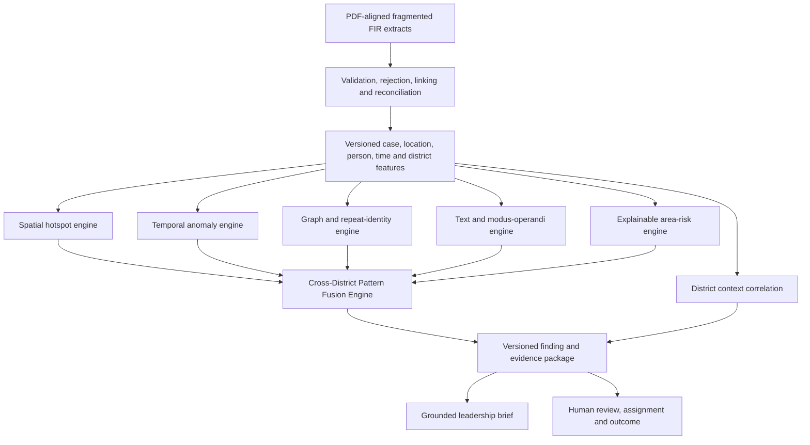

# AI/ML Intelligence Strategy

**Product:** KSP Crime Decision Intelligence Platform  
**Challenge:** Datathon 2026 — Challenge 02  
**Status:** Approved strategy; transparent local baseline verified and Catalyst implementation governed by [`mvp-build-contract.md`](mvp-build-contract.md)
**Deployment:** Catalyst by Zoho, India data centre  
**Flagship capability:** Explainable Cross-District Crime Pattern Fusion

## 1. Decision summary

The platform will compete on the quality of its crime intelligence, not on the number of dashboards or the number of features labelled AI.

Its central differentiator is a Pattern Fusion Engine that combines geographic, temporal, crime-classification, legal, text-derived modus-operandi, identity, and network evidence to find patterns that isolated police units may not see. Every finding remains traceable to stored evidence, exposes its method and limitations, and requires human verification before it becomes confirmed intelligence.

The product will distinguish five kinds of capability in the interface and audit record:

1. statistical analysis;
2. machine-learning model;
3. graph analysis;
4. generative-AI explanation;
5. human-verified finding.

No deterministic rule, hard-coded fixture, or LLM-written paragraph will be presented as a trained model.

## 2. What success means

The MVP succeeds when a jury can observe this working sequence:

**fragmented extracts -> validation and linking -> reusable features -> real analytical execution -> explainable cross-district finding -> map/network/evidence drilldown -> analyst conclusion -> leadership assignment -> recorded outcome**

The MVP does not claim that a model trained on synthetic data is operationally validated for Karnataka. It proves that the platform, interfaces, governance, evaluation approach, and Catalyst deployment path are ready for controlled validation using authorized historical KSP data.

## 3. Competitive position

### What the platform is not

- a collection of unrelated charts;
- an LLM that reads FIRs and invents alerts;
- an individual recidivism or future-offender predictor;
- a black-box district or police-station ranking;
- a notebook whose results are copied into a mock interface;
- a hard-coded demonstration that bypasses ingestion and analytics.

### What makes it defensible

- the supplied FIR schema is preserved in Catalyst;
- fragmented inputs are visibly validated, rejected, linked, and reconciled;
- complementary analytical methods are fused instead of relying on one opaque model;
- planted positive patterns and negative controls are evaluated automatically;
- every output records method, version, evidence, confidence, observation window, and limitation;
- original model output and later human interpretation remain separate;
- intelligence moves through assignment, verification, action, and outcome;
- the solution uses Catalyst-native services where available.

## 4. Intelligence architecture



The engines run independently and persist their own evidence. Pattern fusion references those outputs; it does not erase or rewrite them.

## 5. Method catalogue

| Capability | MVP method | Classification | Stored result |
|---|---|---|---|
| Data quality | schema, relationship, range and reconciliation rules | Deterministic validation | accepted/rejected counts and reason codes |
| Hotspots | Haversine-distance DBSCAN with baseline comparison | Unsupervised spatial ML | cluster, density, growth, severity and evidence cases |
| Trends | rolling counts, rates and period comparisons | Statistical analysis | direction, magnitude and baseline |
| Anomalies | seasonal forecast or robust median/MAD fallback | Time-series ML/statistics | observed, expected range, deviation and evidence |
| Repeat identity | authoritative IDs plus governed candidate matching | Entity resolution | candidate/confirmed/rejected relationship and evidence |
| Networks | evidence graph, connected components and community analysis | Graph analysis | versioned nodes, edges, paths and communities |
| Text similarity | QuickML LLM structured extraction plus deterministic feature similarity | Generative AI + similarity analysis | extracted modus-operandi features, validation and similarity |
| District context | Spearman correlation and descriptive comparison | Aggregate statistics | coefficient, sample size, period, source and caveat |
| Area risk | forward-looking area/time attention score | Explainable scoring/forecast | score, components, forecast period and limitation |
| Pattern fusion | multi-signal similarity graph and cluster qualification | Explainable ensemble | pattern, component contributions and evidence |
| Executive brief | QuickML LLM over a closed evidence payload | Grounded generative AI | generated text, evidence references, model and approval |

## 6. Feature foundation

Only accepted and relationship-resolved source records contribute to intelligence. Rejected records remain visible but are excluded.

### Case features

`TRN_CaseFeature` stores one row per case per feature version, including:

- crime major and minor classification;
- applicable acts and sections;
- gravity and status;
- registration and incident intervals;
- day of week and time band;
- recency and age;
- station, district, and authorized unit hierarchy;
- validated accused-count and case-link indicators;
- text-feature availability;
- source completeness and quality flags.

### Location features

`TRN_LocationFeature` stores validated coordinates, spatial cell, unit boundaries, coordinate-quality status, and feature version. Invalid or missing coordinates never silently become zero coordinates.

### Identity features

`TRN_PersonResolution` stores the two compared source identities, matching method, component evidence, confidence, status, reviewer, and review time. Sensitive demographic fields are excluded from identity-scoring inputs.

### District context features

`TRN_DistrictContext` stores one district-period-variable observation with source, publication period, value, unit, missingness, and `SYNTHETIC` or `PUBLIC` provenance.

## 7. Spatial hotspot engine

### Business question

Where is recent crime geographically concentrated, and is that concentration new or expanding relative to the area's own history?

### MVP method

1. Select accepted cases with valid coordinates for the authorized area, crime family, and observation window.
2. Use Haversine distance so latitude and longitude are treated as positions on Earth.
3. Run DBSCAN to identify dense clusters and noise.
4. Compare the current cluster with the same area's historical baseline.
5. Calculate cluster magnitude, density, gravity mix, recency, growth, and evidence completeness.
6. Persist the cluster and contributing case references in `INT_Hotspot`.

### Configurable starting parameters

- current observation window: 30 days;
- baseline window: preceding 90 days;
- starting urban radius: 1.5 kilometres;
- minimum cases: 5;
- expansion signal: at least 30% higher case count or a materially larger geographic footprint;
- minimum coordinate completeness for alerting: 70%.

These are synthetic-MVP starting values, not KSP operational thresholds. Parameter sets are versioned and must be recalibrated with authorized historical data.

### Explanation contract

Each hotspot shows the observation period, baseline period, number of cases, radius/area, gravity mix, growth, missing-coordinate effect, method version, and contributing cases.

## 8. Trend and anomaly engine

### Business question

Is an observed change genuinely unusual for this unit, crime category, and season, or is it normal variation?

### Grain

Weekly case count by authorized unit and crime category. Daily aggregation may be used only where sufficient history exists.

### Method selection

- With at least 24 regular historical periods: seasonal forecast using Holt-Winters or an approved QuickML time-series anomaly pipeline.
- With 12–23 periods: rolling median and median absolute deviation.
- With fewer than 12 periods: show a trend with an `INSUFFICIENT_BASELINE` limitation; do not create an ML anomaly claim.

### MVP alert condition

An anomaly candidate requires all of the following:

- actual value outside the expected interval or robust deviation score of at least 3;
- absolute increase of at least 3 cases for an upward alert;
- acceptable input completeness;
- no known ingestion duplication affecting the period.

The alert records observed value, expected range, deviation score, baseline history, seasonality handling, model/version, and contributing cases.

### Catalyst decision

QuickML anomaly detection is currently documented as early access and requires Catalyst approval. Access should be requested immediately. If it is unavailable, the deterministic Holt-Winters/median-MAD implementation runs in Catalyst Functions and is labelled accurately.

## 9. Repeat-identity resolution

### Business question

Does the evidence support that accused records in different cases refer to the same synthetic identity?

### Rules

- Matching authoritative `PersonID` values in valid synthetic source records may create a `CONFIRMED` resolution.
- Name, age, gender, location, or text similarity may create only a `CANDIDATE`.
- Name similarity alone can never confirm identity.
- Caste, religion, or socio-economic variables are not identity-scoring features.
- An analyst or authorized officer can mark a candidate `CONFIRMED` or `REJECTED` with a reason.
- A human conclusion never overwrites the original candidate score.

### Evaluation

Measure pairwise precision, recall, and false-confirmation count against hidden synthetic identity truth. The MVP acceptance target is zero automatic false confirmations.

## 10. Network and link-analysis engine

### Graph model

Versioned nodes include case, resolved person, accused appearance, unit, location cell, act, and section. Edges include:

- case-has-accused;
- case-registered-at-unit;
- case-occurred-in-location;
- case-applies-act/section;
- accused-co-appeared-with-accused;
- person-resolved-to-appearance;
- arrest/chargesheet-supported relationship.

Every edge carries evidence type, source record, confidence, verification status, and analysis-run reference.

### Analytical operations

- connected components expose separated records joined by evidence;
- shortest evidence paths explain how two cases or persons are connected;
- co-accused counts reveal repeated collaboration signals;
- community detection groups densely connected evidence subgraphs;
- temporal ordering shows when relationships appeared.

Graph centrality may help analysts navigate large networks, but it cannot be labelled dangerousness or used as proof of guilt.

## 11. Text and modus-operandi engine

### Input

Only synthetic `BriefFacts` text that the user is authorized to access.

### Structured extraction

QuickML LLM Serving receives a constrained prompt and returns validated JSON fields such as:

- entry method;
- target/property type;
- weapon or tool mention;
- vehicle clue;
- time-of-day clue;
- location-context clue;
- action sequence tags;
- uncertainty and missing-information indicators.

Temperature is kept low, the prompt and model are versioned, and output that fails the JSON schema is rejected rather than silently repaired into evidence.

### Similarity

The MVP compares validated extracted tags using weighted Jaccard similarity and compares normalized text terms using TF-IDF cosine similarity. The two values remain separately visible. An LLM does not decide that two cases are connected.

### Grounded brief generation

The LLM receives only a closed evidence payload containing stored metrics, units, periods, limitations, and authorized evidence references. Generated sentences must reference fields from that payload. The output is marked `AI-GENERATED — REQUIRES REVIEW` until an authorized user confirms it.

## 12. Aggregate socio-economic correlation

### Business question

Which district-level contextual variables move with selected crime measures, while acknowledging that correlation does not establish cause?

### MVP method

- compare aligned district-period observations;
- use Spearman rank correlation because small samples and non-linear monotonic relationships are plausible;
- display coefficient, direction, sample size, missing districts, source periods, and data provenance;
- suppress a result with fewer than 10 comparable districts;
- never use caste, religion, or individual socio-economic data;
- never use a correlation to target a person or community.

The UI must state that reporting differences, urbanization, population, time-period mismatch, and omitted variables may influence the relationship.

## 13. Explainable area-risk engine

### Meaning

The score identifies geographic areas and time windows that deserve review. It does not predict that a crime will occur and never scores a person.

### Grain and horizon

One approved area cell or station jurisdiction for the next seven-day attention period, calculated from the preceding history.

### MVP score

Each component is normalized to 0–100 and the versioned score is:

```text
AreaRisk =
  0.25 × forecast-frequency
+ 0.20 × gravity/severity
+ 0.15 × recency
+ 0.15 × trend
+ 0.15 × anomaly-strength
+ 0.10 × hotspot-membership
```

The interface displays every component and the previous score. If baseline sufficiency or location completeness fails, the score is withheld or marked low-confidence rather than imputed into apparent certainty.

Weights are synthetic-MVP starting values and require operational calibration and approval before production use.

## 14. Cross-District Pattern Fusion Engine

### Business question

Are cases across multiple units sufficiently similar across independent evidence families to deserve coordinated analyst review?

### QuickML candidate-clustering pipeline

The candidate QuickML ML pipeline, added only after the transparent vertical slice passes, performs unsupervised candidate clustering over privacy-controlled case features. Inputs include encoded crime classification, cyclic time features, gravity, legal-feature counts, validated location-cell coordinates, and structured modus-operandi tags. Direct names, caste, religion, victim details, and free-form `BriefFacts` are excluded.

The pipeline outputs a model version, cluster label, and noise/outlier status for each eligible case. Cluster co-membership only narrows the cases inspected by Pattern Fusion; it does not create a police alert or prove a relationship. The transparent component scores below remain the basis for qualification and explanation.

### Candidate generation

Candidate case pairs must:

- fall within a configurable 180-day window;
- belong to compatible crime families or share meaningful legal/text evidence;
- have at least two available evidence families;
- remain within the requesting user's authorized scope.

Candidate generation reduces comparisons; it does not establish a relationship.

### Component scores

Each available component is normalized from 0 to 1:

- `SpatialScore`: Haversine proximity and common/adjacent hotspot evidence;
- `TemporalScore`: incident-window proximity and time-band similarity;
- `CrimeScore`: major/minor crime-classification similarity;
- `LegalScore`: Jaccard similarity of acts and sections;
- `TextScore`: structured modus-operandi and TF-IDF similarity;
- `NetworkScore`: confirmed shared identity, co-accused path, or evidence-backed graph proximity.

### Starting fusion formula

```text
PairSimilarity =
  0.20 × SpatialScore
+ 0.15 × TemporalScore
+ 0.15 × CrimeScore
+ 0.10 × LegalScore
+ 0.20 × TextScore
+ 0.20 × NetworkScore
```

When a component is unavailable, the remaining configured weights are renormalized and the missing component is disclosed. A pair with fewer than three available evidence families cannot become a high-confidence fusion edge.

### Pattern qualification

1. Create a case-similarity graph using pair edges at or above 0.65.
2. Find connected components or stable communities.
3. Require at least four cases.
4. For a cross-district claim, require at least two authorized districts or commissionerate units.
5. Require at least three independent evidence families.
6. Apply an evidence-completeness penalty.
7. Persist the original cluster, component contributions, missing evidence, and parameters.
8. Create a human-facing alert only after the analysis run completes successfully.

These thresholds are synthetic-MVP starting values. Automated evaluation may adjust them, but the selected values and evaluation report must be committed before the demo.

### Confidence and language

The system uses `LOW`, `MEDIUM`, or `HIGH` analytical confidence based on evaluated thresholds. It uses phrases such as “potentially related cases” and “requires verification.” It never states that similarity proves common perpetrators or guilt.

## 15. Intelligence and workflow records

The existing physical architecture remains authoritative.

### Transformation records

- `TRN_CaseFeature`
- `TRN_LocationFeature`
- `TRN_PersonResolution`
- `TRN_DistrictContext`

### Intelligence records

- `INT_AnalysisRun`
- `INT_Hotspot`
- `INT_Anomaly`
- `INT_Pattern`
- `INT_AreaRisk`
- `INT_NetworkNode`
- `INT_NetworkEdge`
- `INT_RepeatOffenderSignal`

Every analytical record requires an analysis-run reference, method/version, parameter snapshot, feature version, observation window, evidence references, confidence/severity, limitation, and synthetic-data marker.

### Workflow records

- `WF_Alert`
- `WF_AlertEvidence`
- `WF_Assignment`
- `WF_AnalystConclusion`
- `WF_Outcome`
- `WF_AuditEvent`

Workflow records never modify the original analytical output.

## 16. API boundaries

The implementation plan must define request/response schemas for at least:

- `GET /v1/intelligence/brief`
- `GET /v1/patterns`
- `GET /v1/patterns/{patternId}`
- `GET /v1/hotspots`
- `GET /v1/anomalies`
- `GET /v1/area-risk`
- `GET /v1/networks/{nodeId}`
- `GET /v1/district-context`
- `POST /v1/alerts/{alertId}/acknowledge`
- `POST /v1/alerts/{alertId}/assign`
- `POST /v1/alerts/{alertId}/analyst-conclusion`
- `POST /v1/alerts/{alertId}/outcome`

Every endpoint enforces authentication, explicit permission, unit/geographic scope, evidence classification, and audit logging. Aggregate access never automatically grants personal-evidence access.

## 17. Catalyst implementation map

| Need | Catalyst service | Decision |
|---|---|---|
| Relational sources, features, intelligence and workflow | Data Store | Required |
| Raw extracts, evaluation artifacts and approved evidence objects | Stratus | Required |
| Feature engineering, deterministic analytics and orchestration | Serverless Functions | Primary runtime |
| ML data preparation, cross-case candidate clustering and deployable model endpoint | QuickML | Required selected working ML pipeline |
| Time-series anomaly pipeline | QuickML early access | Request access; Functions fallback if unavailable |
| Structured text extraction and grounded briefs | QuickML LLM Serving | Use with constrained prompts and stored evidence |
| RAG over future approved SOPs/manuals | QuickML Knowledge Base/RAG | Deferred; not required for crime detection |
| Scheduled analytics | Cron or Job Scheduling | Required |
| Post-ingestion processing | Signals and Event Functions | Use after stable ingestion exists |
| Authentication and role access | Catalyst Authentication | Required |
| API protection and routing | API Gateway | Required |
| Web and responsive experiences | Slate or Web Client Hosting | Required |

### Zia AutoML constraint

As of 19 July 2026, Catalyst documentation states that Zia AutoML is unavailable in the India data centre. The current project is in India, so AutoML is not part of the committed MVP architecture. Availability must be rechecked before any future production design.

### Official Catalyst capability references

- [QuickML overview and pipeline capabilities](https://docs.catalyst.zoho.com/en/quickml/)
- [QuickML clustering concepts](https://docs.catalyst.zoho.com/en/quickml/help/learning-center/clustering/)
- [QuickML pipeline endpoints and model versions](https://docs.catalyst.zoho.com/en/quickml/help/pipeline-endpoints/)
- [QuickML anomaly-detection early-access status](https://docs.catalyst.zoho.com/en/quickml/help/ml-algorithms/anomaly-detection/)
- [QuickML LLM Serving and India availability](https://docs.catalyst.zoho.com/en/quickml/help/generative-ai/llm-serving/)
- [Zia AutoML availability constraint](https://docs.catalyst.zoho.com/en/zia-services/help/automl/introduction/)

## 18. Model and analytical governance

Every execution records:

- analysis-run ID;
- method and model name;
- semantic version;
- feature version;
- parameter snapshot;
- training/baseline and observation windows;
- input dataset/batch references and checksum;
- start/end time and status;
- evaluation metrics;
- output count;
- error summary;
- active/retired state.

Changing a threshold, prompt, feature definition, or trained model creates a new version. Historical findings remain reproducible. The MVP does not automatically retrain from analyst feedback.

## 19. Evaluation design

### Dataset profiles

- relationship-validation profile: 50 FIRs;
- jury-demo profile: up to 5,000 FIRs and their related records;
- optional local scale profile: 50,000 FIRs only after the MVP passes.

### Hidden planted truth

The generator records expected outcomes separately from application inputs:

- one emerging hotspot;
- one normal seasonal increase;
- one genuine temporal anomaly;
- one cross-district modus-operandi pattern;
- one confirmed repeat identity;
- one similar-name false match;
- one evidence-backed co-accused community;
- one explainable area-risk increase;
- invalid coordinates, duplicate cases, and orphan keys;
- one pattern that an analyst should reject.

The application never reads the expected-outcome file during inference.

### Metrics

| Capability | MVP evaluation |
|---|---|
| Hotspot | planted-cluster detection, case membership precision/recall and noise rate |
| Anomaly | event precision/recall, false-positive rate and seasonal negative-control result |
| Identity | pair precision/recall and automatic false-confirmation count |
| Pattern fusion | pattern precision/recall, evidence-family coverage and false-link rate |
| Risk | component reproducibility, direction correctness and withheld-score rules |
| Text extraction | JSON validity, field-level accuracy on labelled synthetic facts and unsupported-field rate |
| Brief generation | evidence-reference coverage and unsupported-claim count |
| Platform | run reconciliation, end-to-end processing time and API latency for precomputed results |

### MVP acceptance targets

- 100% of significant findings link to an analysis run and evidence;
- 100% of displayed data is visibly synthetic;
- zero automatic identity confirmations based only on names;
- zero unsupported claims in the accepted leadership brief fixture;
- seasonal negative control is not promoted as an anomaly;
- planted cross-district pattern is discovered without reading fixture truth;
- pattern and identity precision are at least 0.80 on the demo profile;
- all rejected rows are excluded from analytical inputs;
- precomputed intelligence APIs meet a two-second local/demo p95 target;
- every analyst and leadership action creates an audit event.

These targets prove implementation behavior on synthetic data, not operational accuracy on real KSP data.

## 20. User-facing explanation contract

Every alert and score must answer:

1. What was detected?
2. Where and during which period?
3. What baseline or comparison was used?
4. Which evidence families contributed?
5. Which cases or aggregates support it?
6. What evidence is missing or unreliable?
7. Which method/version produced it?
8. How confident or severe is it?
9. What does the system recommend reviewing?
10. Who verified it, and what happened next?

## 21. Failure handling

- Failed ingestion: no downstream analysis starts for the failed batch.
- Partial relationship resolution: unresolved data is excluded or marked according to the entity contract.
- Failed feature job: prior successful feature version remains active.
- Failed model/analysis run: no alert is created.
- QuickML endpoint unavailable: record failure; do not replace it with a fabricated result.
- Invalid LLM JSON: reject extraction and mark text evidence unavailable.
- Unsupported generated sentence: reject the brief and retain the structured evidence summary.
- Insufficient baseline: withhold anomaly/risk claims and show the limitation.
- Retry: batch, input checksum, feature version, and analysis version enforce idempotency.

## 22. Security and policing safeguards

- no individual future-crime prediction;
- no sensitive-demographic targeting;
- no causal claim from district correlation;
- no automated guilt or association conclusion;
- no unrestricted access created by senior rank alone;
- no LLM access to evidence outside the caller's authorization;
- no model result overwrites source records;
- no analyst conclusion overwrites original model output;
- no production claim based solely on synthetic evaluation;
- all evidence access, decisions, exports, and model/version changes are auditable.

## 23. Demonstration sequence

1. Show separate synthetic source extracts and their checksums.
2. Run or show a completed ingestion with accepted and rejected records.
3. Open the State Intelligence Brief after a completed analysis run.
4. Show the discovered cross-district pattern and component contributions.
5. Drill from state to districts, stations, hotspot, timeline, and cases.
6. Open the offender/co-accused evidence graph.
7. Show the anomaly's observed value, expected range, and baseline.
8. Show that the seasonal negative control was not alerted.
9. Show the area-risk change and all component contributions.
10. Let the analyst submit a structured conclusion with limitations.
11. Assign the verified alert and record an outcome.
12. Show Catalyst services, analysis version, evaluation report, and audit trail.

## 24. Delivery priority

### Priority 0 — completed foundation

- PDF-aligned Catalyst source tables;
- Catalyst-native references;
- ingestion-control tables;
- schema tests and export comparison.

### Priority 1 — intelligence proof

- deterministic synthetic generator and hidden truth;
- ingestion and relationship resolution;
- compact features;
- hotspot, anomaly, network/repeat, risk, and pattern-fusion engines;
- evaluation harness and persisted evidence.

### Priority 2 — operational platform

- State, District/Division, and Analyst experiences;
- maps and evidence drilldowns;
- authentication and geographic scope;
- alerts, conclusions, assignment, outcome, and audit.

### Priority 3 — Catalyst AI depth and presentation

- selected QuickML pipeline and endpoint;
- QuickML structured extraction and grounded brief;
- scheduled/event-driven refresh;
- polish, performance evidence, demo video, and pitch.

### Deferred

CCTV, public/social signals, major-event priorities, full Command Centre, full station case-management, and offline investigator features remain governed roadmap items.

## 25. Challenge 02 traceability

| ID | Challenge capability | Intelligence proof |
|---|---|---|
| CH02-01 | Fragmented records | separate extracts, validation, rejection, key mapping and reconciliation |
| CH02-02 | Actionable intelligence | versioned finding -> human review -> assignment -> outcome |
| CH02-03 | Dashboards/maps | role-aware brief, district pulse, analyst map/network/evidence views |
| CH02-04 | Hotspots | Haversine DBSCAN with baseline and evidence cases |
| CH02-05 | District drilldowns | state -> district -> station -> finding -> case |
| CH02-06 | Trends/anomalies | seasonal forecast or robust fallback with negative control |
| CH02-07 | Network/link analysis | evidence-labelled graph and explainable paths |
| CH02-08 | Repeat offenders | governed identity resolution and cross-case history |
| CH02-09 | Socio-economic correlation | aggregate Spearman analysis with sources and caveats |
| CH02-10 | Predictive risk scoring | next-period area/time attention score with components and limitations |
| CH02-11 | AI/ML pattern detection | evaluated multi-signal cross-district Pattern Fusion Engine |

## 26. Production validation required from KSP

Before operational use, KSP must approve or provide:

- authoritative case, identity, and organizational keys;
- historical data access and permitted analytical purpose;
- retention and evidence-handling policies;
- operational definitions of hotspot, anomaly, repeat identity, and risk;
- unit-specific geographic and seasonal baselines;
- acceptable alert precision, recall, and workload;
- model and threshold approval authority;
- human-review and escalation responsibilities;
- fairness, legal, security, and audit review;
- controlled pilot design and monitoring criteria.

The MVP is a serious platform candidate because it makes this validation possible and auditable; it does not bypass it.
