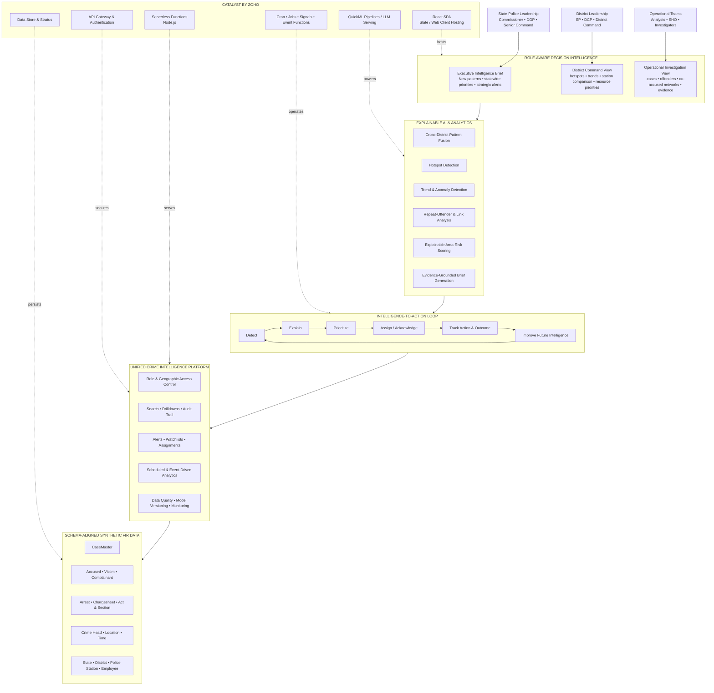

# KSP Crime Decision Intelligence Platform

## Business Architecture Explained in Plain Language

**Challenge:** Datathon 2026 - Challenge 02  
**Deployment:** Catalyst by Zoho  
**Positioning:** Decision Intelligence for Policing  
**Status:** Approved product-flow foundation. The executable MVP scope is locked in [`mvp-build-contract.md`](mvp-build-contract.md).

## What are we building?

We are building one governed platform that connects fragmented FIR records, discovers explainable crime patterns, sends the right intelligence to the right policing level, and tracks what action was taken.

It is not just a dashboard. A dashboard stops after showing information. This platform continues from detection to explanation, assignment, action, and outcome.

It is also not a black-box predictive-policing system. The platform supports police judgment. It must show the evidence behind every important alert or score, and an authorized police officer remains responsible for the decision.

The platform should answer five business questions:

1. What is happening?
2. Where is it happening?
3. What changed or appears unusual?
4. Which cases, people, locations, and patterns may be connected?
5. What requires attention, who owns the response, and what was the outcome?

## One picture of the platform

## 1. Users: who receives the intelligence?

### State Police Leadership

This includes the Commissioner, DGP, and other senior leaders.

They do not need to inspect every FIR. They need answers such as:

- What new crime patterns are emerging across Karnataka?
- Which districts require attention?
- Is a particular offence spreading across district boundaries?
- Where is crime increasing unusually?
- What strategic intervention may be required?
- Are important intelligence alerts being acted upon?

Their main experience is an executive intelligence brief. It shows the pattern, why it matters, the evidence summary, the affected districts, and the current response status. Leadership can drill down when needed, but the default view should not overwhelm them with raw records.

### District Leadership

This includes SPs, DCPs, and district command teams.

They need operational answers:

- Which police stations show unusual activity?
- Where are today's or this week's hotspots?
- Which crime categories are increasing?
- Which alerts require district-level action?
- How does the district compare with previous periods?
- Which assigned actions are pending?

Their main experience is the District Command View. A district leader can move from the district summary to an affected police station, alert, and supporting evidence.

### Operational Teams

This includes crime analysts, SHOs, and investigating officers.

They need the underlying evidence:

- Which FIRs contributed to an alert?
- Which accused persons appear repeatedly?
- Which cases share co-accused persons?
- Are similar offences occurring at similar times and locations?
- Which act, section, station, or modus operandi connects the cases?
- What action has been requested, and who owns it?

Their main experience is the Investigation View. It allows authorized users to inspect cases, people, links, locations, legal sections, arrests, and timelines.

## 2. Role-aware decision intelligence

Everyone uses the same platform, but they do not see the same information.

The system considers the user's role and geographic authority. State leadership may see statewide intelligence. A district SP may see the district and its subordinate stations. An SHO may see the relevant police station. An investigator may see assigned or otherwise authorized cases.

### Leadership → Executive Intelligence Brief

The system produces a concise statewide summary. For example:

> Robbery incidents increased abnormally across three adjoining districts during late-evening hours. Twelve cases share similar offence classifications, geographic characteristics, and time patterns.

Leadership receives the pattern, business importance, evidence summary, confidence, limitations, and recommended review - not hundreds of raw records.

### District leadership → District Command View

A district SP can inspect:

- district risk map;
- police-station comparisons;
- crime trends;
- active alerts;
- hotspot changes;
- pending actions.

The user can move from the district summary to an affected police station, then to the alert and its evidence.

### Operational teams → Investigation View

An analyst or investigator can open the evidence behind an alert:

- relevant FIRs;
- accused persons;
- co-accused relationships;
- arrest history;
- legal sections;
- locations and timelines;
- similar brief-fact or modus-operandi signals.

This creates accountability. Every high-level statement must be traceable to supporting records that the user is authorized to view.

The role hierarchy, permission model, experience depth, routes, and MVP screen entitlements are approved. Their executable boundary is maintained in [`mvp-build-contract.md`](mvp-build-contract.md).

Detailed and approved role behavior is maintained in [`role-access-and-experience-design.md`](role-access-and-experience-design.md). This keeps the business blueprint readable while preserving role-level features as part of the architecture.

## 3. Explainable AI and analytics

The dashboards do not calculate intelligence themselves. They request prepared and governed insights from the analytics layer.

AI helps detect, connect, prioritize, and explain patterns. It does not replace police judgment.

### Cross-District Pattern Fusion

This is our main differentiator.

The system searches for patterns that individual police stations may not notice because their records are separated. It may compare:

- similar crime types;
- the same or related time windows;
- nearby roads, highways, or geographic corridors;
- related acts and sections;
- common accused or co-accused persons;
- similar text or modus-operandi hints in `BriefFacts`;
- occurrences across multiple districts.

The platform combines these signals and creates one cross-district intelligence alert with the supporting cases, people, places, and reasons.

A similarity is an investigative signal. It is not proof that the same person or group committed the offences.

### Hotspot Detection

The system groups incidents geographically and identifies unusually concentrated crime areas.

A hotspot is not simply a place with many cases. It should consider:

- recent case volume;
- crime severity;
- recency;
- crime category;
- time of day;
- geographic concentration;
- comparison with the location's normal baseline.

### Trend and Anomaly Detection

Trend analysis answers:

> Is crime gradually increasing or decreasing?

Anomaly detection answers:

> Did something happen that is significantly different from normal?

For example, a station normally records two burglary cases per week but suddenly records nine. That may deserve attention even if another station has a higher total count.

### Repeat-Offender and Link Analysis

The platform connects:

- accused to cases;
- accused to co-accused;
- accused to police stations;
- accused to offence types;
- arrests to cases;
- cases to acts and sections.

It helps investigators see relationships that are difficult to identify through separate FIR reports.

This is intelligence support. It is not a prediction that an individual will commit another crime.

### Explainable Area-Risk Scoring

Each geographic area receives a risk signal based on measurable factors such as:

- recent crime count;
- severity;
- rate of increase;
- recency;
- hotspot membership;
- anomaly strength.

The risk signal helps prioritize attention. It does not claim that crime will occur.

The platform must show why the score changed, the observation period, and which calculation or model version produced it. For example:

> Risk increased from 42 to 68 because serious property offences rose by 35%, six incidents occurred within 1.2 km, and four occurred during the same evening time band.

### Evidence-Grounded Brief Generation

AI converts structured findings into readable summaries.

It does not invent findings. It receives calculated evidence and explains it in business language.

The generated brief must link back to:

- relevant metrics;
- districts and stations;
- time period;
- crime categories;
- supporting cases available to the authorized user.

## 4. Intelligence-to-action loop

This is what converts the solution from a dashboard into an operational platform.

### Detect → Explain

The system discovers a hotspot, anomaly, network, repeat-offender signal, area-risk change, or cross-district pattern.

It then explains:

- what was detected;
- why it matters;
- what evidence supports it;
- how strong or confident the signal is;
- what limitations exist.

### Explain → Prioritize

Not every signal becomes a critical alert.

The platform prioritizes signals using transparent factors such as:

- severity;
- scale;
- recency;
- geographic spread;
- confidence;
- potential operational importance.

### Prioritize → Assign or acknowledge

An authorized leader can:

- acknowledge the alert;
- assign it to a district or analyst;
- request verification;
- mark it as being monitored;
- escalate it;
- dismiss it with a recorded reason.

The AI recommends attention. An accountable police officer makes the decision.

### Assign → Track action and outcome

The platform records:

- who owns the alert;
- what action was selected;
- current status;
- notes;
- due date;
- outcome.

This creates an audit trail.

### Outcome → Improve future intelligence

The result becomes feedback. Examples include:

- useful alert;
- duplicate pattern;
- false positive;
- already known;
- investigation initiated;
- no action required.

In a mature system, this feedback helps improve thresholds and models. The MVP can demonstrate the feedback structure without claiming fully automated retraining.

## 5. Unified platform services

All user experiences and intelligence workflows depend on shared production capabilities.

### Role and geographic access control

Users see information according to their authority. The final role-to-permission matrix will be designed separately.

### Search, drilldowns, and audit trail

Authorized users can move through the evidence chain:

**State → District → Police Station → Alert → Case → Supporting Entity**

Sensitive access and business actions are recorded.

### Alerts, watchlists, and assignments

These are persistent business records, not temporary notifications.

An alert remains available until it is reviewed, assigned, resolved, or dismissed with a recorded reason.

### Scheduled and event-driven analytics

Some intelligence runs on a schedule:

- daily hotspot refresh;
- periodic leadership brief;
- recurring anomaly scan;
- area-risk recalculation.

Other intelligence can run after new records are added:

- update repeat-offender counts;
- recalculate case links;
- check whether a known pattern has expanded;
- refresh affected alerts.

### Data quality, model versioning, and monitoring

A near-production platform must show whether its input and output are trustworthy.

It should detect:

- missing coordinates;
- invalid dates;
- unknown station references;
- duplicate cases;
- incomplete accused information.

Every significant score or alert should record the calculation or model version that produced it.

## 6. Schema-aligned synthetic FIR data

The supplied `Police_FIR_ER_Diagram.pdf` is the platform's data foundation. It describes the structure used by the FIR system but does not contain actual case records.

The MVP will therefore generate privacy-safe synthetic records directly against the supplied schema. The data should preserve realistic relationships, organizational hierarchy, dates, locations, and deliberately planted analytical patterns. It must be clearly labelled as synthetic and must not imitate identifiable real people.

To visibly address fragmented records, the synthetic data will arrive as separate source extracts for cases, people, arrests, legal mappings, organizational units, and district context. The platform validates and links these extracts into the intelligence layer, records rejected rows and quality issues, and only then runs analytics.

### `CaseMaster`

This is the central case record. It provides:

- crime number;
- registration date;
- incident period;
- location;
- police station;
- crime classification;
- case status;
- gravity;
- brief facts.

### People entities

`Accused`, `Victim`, and `ComplainantDetails` connect people to cases.

### Legal and investigation entities

`ArrestSurrender`, `ChargesheetDetails`, and `ActSectionAssociation` show:

- whether an accused was arrested or surrendered;
- when a chargesheet was filed;
- which acts and sections apply.

### Crime, time, and location entities

These support trends, hotspots, anomaly detection, risk scoring, and comparisons.

### Organizational hierarchy

`State`, `District`, `Unit`, and `Employee` determine:

- who owns a case;
- which station belongs to which district;
- what geographic data a user may access;
- how drilldowns work.

### Aggregate district context

A separate analytics-oriented district-context dataset supports the challenge's socio-economic correlation requirement. Candidate variables include population density, urbanization, literacy, livelihood/employment proxy, and economic-activity proxy.

The District Context Lens remains aggregate. It must show data source, period, missingness, and limitations; it must never present correlation as causation or use sensitive individual characteristics for targeting.

## 7. Catalyst by Zoho

Catalyst provides the technical foundation without becoming the business story. Deployment through Catalyst is mandatory, and Catalyst-native services should be used whenever they provide the required capability.

### React SPA → User experience

Catalyst Slate or Web Client Hosting delivers the dashboards, maps, alerts, network views, and investigation screens.

### Serverless Functions → Platform logic

Node.js Catalyst Serverless Functions calculate analytics, enforce business rules, use Catalyst SDKs, and provide application APIs.

### API Gateway and Authentication → Security

These services control:

- login;
- API access;
- role validation;
- request routing;
- protection against unauthorized access.

### Data Store and Stratus → Persistence

Catalyst Data Store holds structured FIR data, analytical features, alerts, explanations, assignments, outcomes, and audit records.

Catalyst Stratus holds larger files such as imports, generated reports, or exported evidence packs when required.

### QuickML Pipelines and LLM Serving → Intelligence

QuickML supports the selected ML pipeline, model endpoint, structured text extraction, and evidence-grounded brief generation. It should only be used where it adds measurable value and where evaluation evidence is available.

Simple and explainable calculations may remain in Serverless Functions rather than forcing every feature into an ML model.

Catalyst currently documents Zia AutoML as unavailable in the India data centre, so it is not part of the committed MVP architecture. The authoritative analytical design is maintained in [`ai-ml-intelligence-strategy.md`](ai-ml-intelligence-strategy.md).

### Cron, Jobs, Signals, and Event Functions → Operations

These services run intelligence continuously through scheduled scans, alert refreshes, post-ingestion processing, and leadership-brief generation.

AppSail remains deferred unless the final design requires a custom runtime, long-running process, or dependency that Serverless Functions cannot support.

## Complete business flow

The complete sequence is:

1. Schema-aligned synthetic FIR records enter the unified platform.
2. The platform validates and connects the records.
3. Analytics detect hotspots, anomalies, repeat-offender links, area-risk changes, and cross-district patterns.
4. Every significant finding becomes an explainable intelligence record.
5. Each policing level receives the appropriate view based on role and geographic authority.
6. Authorized officers review, acknowledge, assign, and track actions.
7. Outcomes are recorded for audit and future improvement.

## Deferred operational and external-signal expansion

The platform may later incorporate authorized CCTV-derived alerts, verified public/social signals, major-event priorities, a large-screen Command Centre mode, leadership case-ageing summaries, station operational indicators, and a responsive investigator tablet experience.

These are supporting inputs and delivery surfaces around the Crime Analytics Engine. They do not replace any Challenge 02 capability and are not part of the core implementation until the fragmented-record, analytics, evidence, drilldown, and accountable-action journey is working.

The approved boundary, safeguards, role experiences, future processing flow, and Catalyst service direction are defined in [`deferred-signal-and-operational-expansion.md`](deferred-signal-and-operational-expansion.md).

## Safety and trust boundaries

- The platform supports human decisions; it does not autonomously direct police action.
- Area-risk scores prioritize review; they do not claim that crime will occur.
- Link similarity is an investigative signal, not proof of guilt or association.
- The MVP will not predict that a specific person will commit a crime.
- Sensitive demographics will not be used for individual targeting.
- Any future socio-economic analysis must remain aggregate and carefully caveated.
- Generated text must be grounded in stored analytical evidence.
- Significant conclusions must be traceable to supporting records.
- Missing data, confidence, limitations, and calculation/model versions must be visible.
- Synthetic data must be prominently identified.

## What near-production MVP means

Near production does not mean building every possible feature. It means building a thin but complete operational journey with credible production boundaries.

The MVP should demonstrate:

- schema-aligned synthetic FIR data;
- secure role-based and geography-aware access;
- leadership, district, and operational drilldowns;
- one strong cross-district pattern-discovery journey;
- supporting hotspots, anomalies, repeat-offender links, and area-risk signals;
- explanations linked to evidence;
- persistent alerts, assignment, acknowledgment, and outcome tracking;
- scheduled or event-driven intelligence refresh;
- data-quality visibility, audit history, and analytical versioning;
- deployment through Catalyst-native services.

The implementation boundary is strict:

- fully implement State Leadership, District/Division Leadership, and Crime Analyst experiences;
- provide a lighter shared Station Command/Investigating Officer view;
- prove Administrator and Auditor controls through configuration, status, and audit evidence;
- represent Regional/Commissionerate Leadership through adaptive organizational scope rather than a separate large module.

Challenge coverage and proof are maintained in [`challenge-traceability.md`](challenge-traceability.md).

The exact user hierarchy, screens, analytics methods, synthetic-data scenarios, security matrix, and final MVP cut line must be designed and approved before implementation begins.
