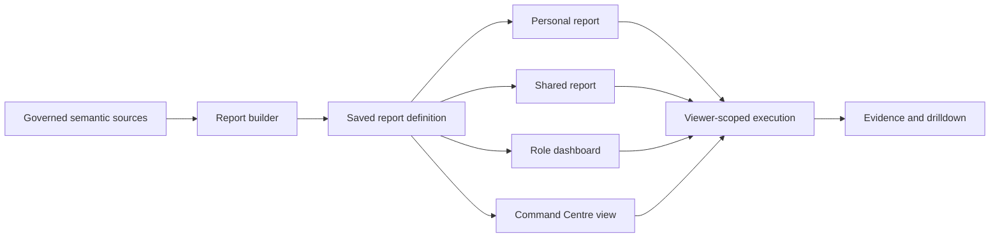

# Governed Report and Map Builder Design

**Date:** 2026-07-24

**Status:** Approved direction; written review required before implementation

**Product:** KSP ACE — Analytics · Crime · Enforcement

## 1. Outcome

Upgrade the existing governed report builder into the reusable delivery layer for KSP ACE. Authorized analysts and administrators create reports and maps from business-level intelligence sources; the same saved definition can be run privately, shared, published to a role dashboard, or shown full-screen in the Command Centre. Every execution re-applies the viewer's role and geographic scope.

The shortlist slice proves one complete path:

```text
persisted FIR and intelligence data
→ governed semantic source
→ report definition
→ KPI, table, trend, or map preview
→ saved report
→ dashboard placement
→ viewer-scoped execution and evidence drilldown
```

The system extends the current report, dashboard, geospatial, authentication, and Catalyst Function boundaries. It does not introduce a second analytics engine, query engine, map implementation, or authorization model.

## 2. Product Position

KSP ACE is not a generic business-intelligence tool. Configurable reporting is the platform layer through which policing intelligence is delivered.

- Analysts and authorized administrators create and maintain reports.
- Administrators publish role-default dashboards.
- Leadership and operational officers receive useful default views without building reports.
- Users may copy, customize, or share content only within policy.
- AI/ML outputs are first-class semantic sources with method, version, evidence, quality, and limitations.
- Reports never create access. The viewer's current authorization controls every execution and drilldown.

## 3. Role Experience

| Persona | Default consumption | Builder access |
|---|---|---|
| Command Centre | Full-screen operational maps, alerts, counts, and event views | Open and filter published reports; no global publication |
| State leadership | Statewide executive dashboard with drilldowns | Copy/customize permitted reports where authorized |
| Regional/district leadership | Jurisdiction-scoped trends, hotspots, station comparison, and alert status | Create scoped reports if permission is granted |
| Station operations / SHO | Active cases, ageing, local trends, assignments, and local hotspot context | Run and personalize approved reports; builder optional by policy |
| Crime analyst | Pattern, anomaly, hotspot, network, identity, and data-quality workbench | Full governed builder and sharing within authorization |
| Platform administrator | Role defaults, global catalogue, permissions, and content governance | Full builder, publication, and role-default assignment |

## 4. Information Architecture

The existing application shell gains one stable `Reports` application with:

- **My reports** — definitions owned by the caller.
- **Shared with me** — definitions shared directly or through an authorized unit/role.
- **Role reports** — administrator-published reports for the active persona.
- **Organization reports** — global governed content.
- **Create report** — the five-stage builder.

Scheduled delivery and arbitrary exports remain outside the shortlist slice.



## 5. Builder Workflow

The builder uses a single workspace and five clear stages. The preview remains visible while configuration changes.

### 5.1 Data

The author supplies a report name and chooses one governed source. The UI presents business terms, never Catalyst table names or ZCQL.

Initial sources reuse the current semantic registry:

- command brief;
- crime patterns;
- hotspots;
- trend anomalies;
- explainable area risk;
- district context;
- intelligence alerts.

The catalogue later expands through the same registry contract; physical FIR entities are not exposed directly in this slice.

### 5.2 Visualisation

The source advertises only compatible visualisations. The shortlist release supports:

- number/KPI;
- table;
- bar;
- line/trend;
- governed map view.

Map is not a separate reporting subsystem. It embeds a saved Geospatial Studio view executed through the existing MapLibre/deck.gl path.

### 5.3 Configure

For non-map reports:

- zero or one grouping dimension in the shortlist slice;
- one aggregate measure;
- bounded filters using the existing allowlisted operators;
- ascending or descending sort;
- result limit from 1 to 200.

For map reports:

- choose one authorized saved map view;
- retain that view's layers, renderer, viewport, time window, and evidence behavior;
- do not duplicate map transforms inside the report definition.

### 5.4 Style

Style options remain intentionally bounded:

- report title and optional description;
- chart legend on/off where applicable;
- data labels on/off where applicable;
- semantic palette preset;
- compact, standard, or presentation density.

Authors cannot inject CSS, HTML, scripts, arbitrary colors, or remote assets.

### 5.5 Review

The author previews live governed results, sees the effective scope and freshness, then saves. The review stage shows validation problems before save and never substitutes fabricated preview data.

After saving, the owner can:

- run the report;
- add it to an existing authorized dashboard;
- create a personal dashboard containing it;
- share it within permitted targets;
- copy it as a new personal definition.

## 6. Map and ML Integration

The map experience uses the already selected stack: MapLibre, deck.gl, H3, PMTiles protocol support, Supercluster, and OpenFreeMap fallback.

The first operational composition contains only persisted model outputs:

- DBSCAN hotspot centroids and contributing cases;
- Median/MAD anomaly results after station/district geometry resolution;
- H3 area-risk cells;
- Pattern Fusion cross-district links when the result has valid spatial evidence;
- authorized intelligence alerts linked to those findings.

Each selected feature opens evidence showing method, model/engine version, run, observation period, confidence or severity, contributing authorized FIRs, limitations, and data quality. Synthetic inputs are permitted for the datathon, but analytical results are always computed and persisted rather than hardcoded.

The current map catalogue has executable hotspot geometry. Enabling anomaly and area-risk map reports therefore requires completing their geometry contracts before they appear as available layers.

## 7. AI-Assisted Authoring Boundary

Natural-language report creation is a genuine QuickML enhancement, not a prerequisite for the deterministic builder.

When a real QuickML endpoint and Catalyst Connection are configured, the user may ask:

> Show vehicle-theft hotspots in Bengaluru North for the last 30 days compared with the previous 30 days.

QuickML may return only a draft report definition. Server-owned validation must then verify:

- semantic source and fields;
- visualization compatibility;
- filters and observation period;
- geographic authorization;
- result and cost limits.

The user reviews and confirms the draft before execution. QuickML does not execute raw queries, invent model findings, expand access, or independently publish content.

No QuickML label or AI authoring control appears until a real endpoint invocation and persisted run evidence have passed integration tests.

## 8. Existing Components to Reuse

The implementation extends these existing boundaries:

- `web/src/features/reports/ReportBuilder.jsx` — current source selection, definition save, execution, and map preview.
- `web/src/features/dashboards/` — saved dashboard and report placement.
- `web/src/features/geospatial/` — map composition, saved views, layers, evidence, and MapLibre/deck.gl rendering.
- `functions/crime_intelligence_api/app/src/backend/reporting/` — semantic registry, report validation, execution, persistence, and dashboard services.
- `CFG_ReportDefinition`, `CFG_Dashboard`, `CFG_DashboardItem`, `CFG_ContentShare`, and `CFG_UserPreference` — existing Catalyst configuration tables.

The builder is split into focused feature components rather than expanding the current file into a monolith: catalogue, stage navigation, data form, visualization picker, configuration form, style form, preview, and save/share actions.

## 9. UX and Visual Rules

- Preserve the approved KSP ACE header and smooth white Catalyst-like shell.
- Use the approved Roboto typography and existing semantic design tokens; do not adopt a new font or marketing-page style.
- Use a dense enterprise workspace with clear labels, restrained borders, limited card chrome, and one primary action per stage.
- Keep the preview dominant and avoid the box-heavy dashboard appearance previously rejected.
- Use Lucide icons with visible labels; do not use emoji or decorative illustration.
- Preserve native focus behavior, keyboard stage navigation, labelled fields, 44-pixel interactive targets, sufficient contrast, and reduced-motion support.
- At desktop widths, use a compact configuration rail plus preview. At narrow widths, stack configuration above preview without horizontal page scrolling.
- Loading, empty, validation, forbidden, partial-data, stale-run, and execution-failure states remain explicit and recoverable.

## 10. Data and Authorization Flow

1. Client requests `/v1/report-sources`.
2. Server returns only semantic sources allowed for the caller.
3. Client builds a declarative definition.
4. Server normalizes the definition against its source allowlist.
5. Save persists configuration, owner, version, and visibility—not result rows.
6. Execute resolves the viewer's current access profile and unit hierarchy.
7. The existing governed read service supplies bounded data.
8. The client renders the selected visualization.
9. Map selection requests only authorized evidence through existing APIs.
10. Sharing changes discovery, never execution authority.

## 11. Error Handling

- Source catalogue failure leaves the report library usable and offers retry.
- Invalid source, field, aggregate, visualization, map view, filter, sort, or limit is rejected server-side with a stable validation code.
- A map view with unavailable geometry cannot be selected for publication.
- Preview cancellation or stale responses cannot overwrite a newer definition.
- A widget/report failure is isolated and does not blank its containing dashboard.
- A shared report that resolves to no authorized rows shows a legitimate empty result, not the owner's data.
- Save conflicts preserve the local draft and require reload or copy; they never silently overwrite another version.

## 12. Shortlist Acceptance Journey

1. Sign in as KSP Intelligence and select Crime Analyst.
2. Open Reports and see My, Shared, Role, and Organization catalogue tabs.
3. Create a report from the Crime Hotspots source.
4. Choose Map, select the verified Karnataka hotspot view, and preview persisted DBSCAN results.
5. Select a hotspot and inspect run version, observation period, confidence, contributing FIRs, and limitations.
6. Save the report and add it to a personal dashboard.
7. Share or publish it to an authorized role dashboard.
8. Switch to a narrower persona and show the same definition returning only that persona's permitted geography.
9. Add a KPI or trend report from anomalies to the same dashboard.
10. Demonstrate that a new successful intelligence refresh updates the report without editing its definition.

The slice fails acceptance if any result is hardcoded, if maps use invented coordinates, if shared content executes with the owner's scope, if report definitions can reference physical tables or raw queries, or if the browser journey cannot complete against Catalyst-persisted data.

## 13. Deliberate Deferrals

To meet the shortlist deadline, do not build:

- arbitrary SQL, joins, formulas, scripts, or raw table access;
- a free-form pixel canvas;
- scheduled reports, email exports, PDFs, or spreadsheets;
- custom visualization plugins;
- live CCTV/social feeds;
- unrestricted natural-language query execution;
- a new component framework, chart library, state library, or map library;
- the full breadth of ServiceNow reporting administration.

Add these only after the working report → map → dashboard → scoped-viewer journey is verified.

## 14. Delivery Order

1. Upgrade the existing report library and five-stage builder UI without changing backend semantics.
2. Complete filters, sorting, bounded style options, and reliable preview state.
3. Complete anomaly and area-risk geometry contracts and their map publication tests.
4. Connect save, share, and add-to-dashboard actions to existing services.
5. Prove viewer-scoped execution across two personas.
6. Load a larger statewide synthetic FIR input set and run the existing deterministic intelligence pipeline.
7. Demonstrate incremental refresh changing persisted outputs and map/report results.
8. Add one genuine QuickML draft-authoring capability only after its real Catalyst endpoint is available.

